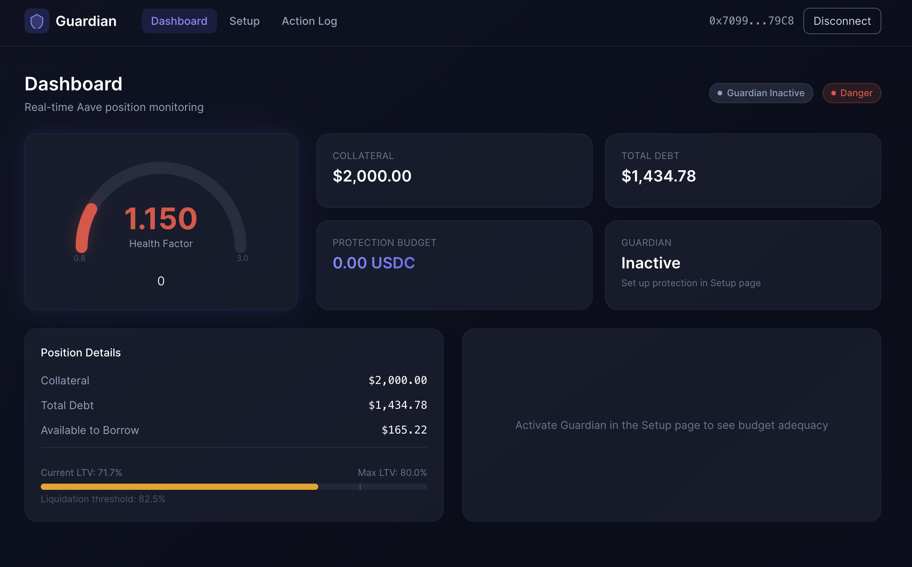
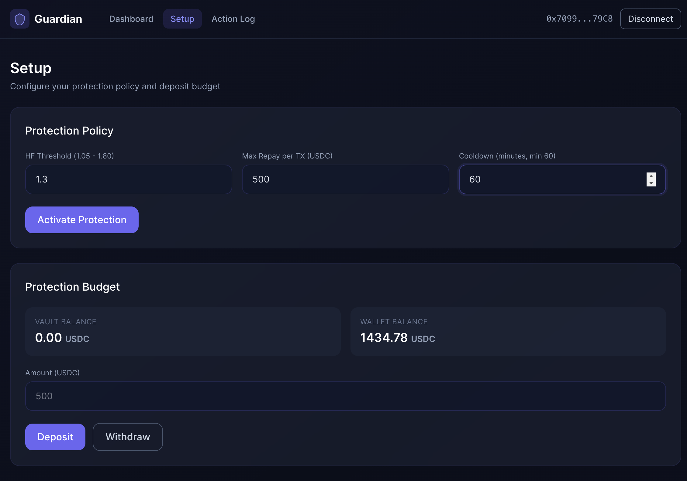
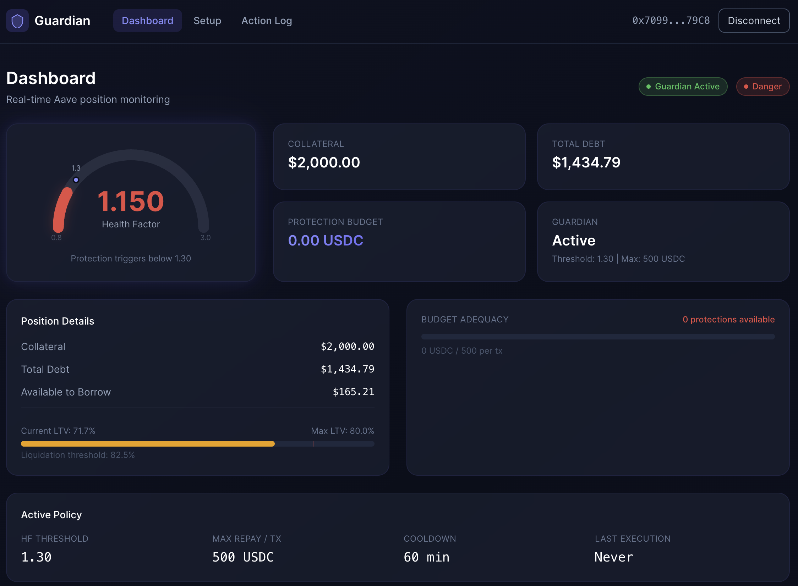
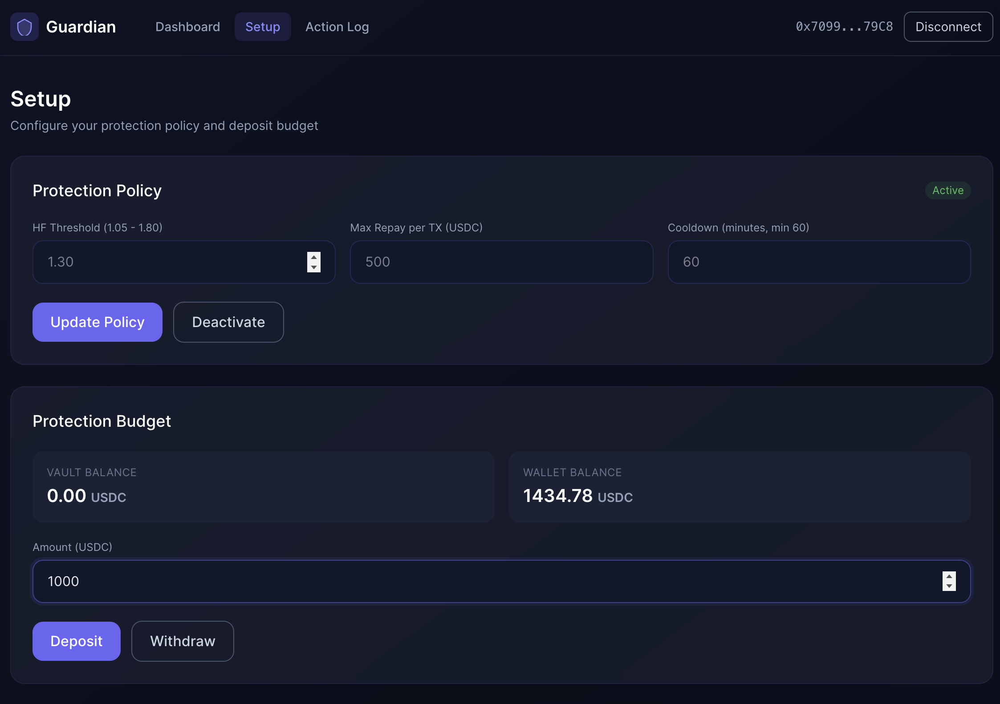
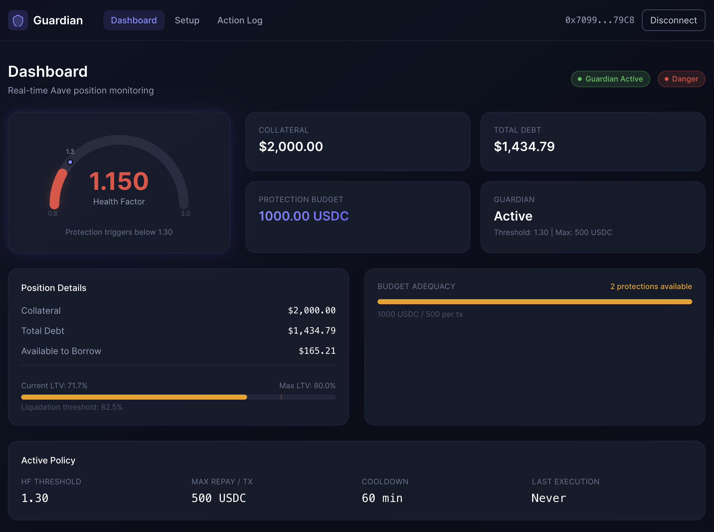
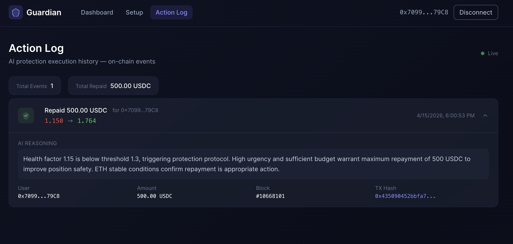

# Demo: AI-Powered Liquidation Protection

This demo walks through the full AI Guardian protection flow — from a dangerously leveraged Aave position to automatic recovery by the AI Agent.

> **Result:** Health Factor **1.15 (Danger)** → **1.76 (Safe)**, fully automated.

## Setup

Start an [Anvil](https://book.getfoundry.sh/reference/anvil/) fork of Sepolia and run the setup script to create a test Aave position:

```bash
# Terminal 1 — keep running
anvil --fork-url $SEPOLIA_RPC_URL

# Terminal 2
./script/setup-demo.sh
```

The script creates an Aave lending position with **HF 1.15** (below the 1.3 protection threshold), then starts the frontend. Connect MetaMask with an Anvil test account, pointing RPC to `http://127.0.0.1:8545`.

---

## Step 1: Identify the Dangerous Position

The Dashboard shows a real-time view of the user's Aave position.



The position is in **Danger**:
- **Health Factor 1.150** — deep in the red zone
- **$2,000 collateral** vs **$1,434 debt** — Current LTV 71.7%, approaching the 82.5% liquidation line
- **No protection active** — Guardian is Inactive, budget is empty

If ETH price drops further, this position will be liquidated.

## Step 2: Activate Protection Policy

On the **Setup** page, configure the protection parameters:



- **HF Threshold: 1.3** — trigger protection when HF falls below this
- **Max Repay: 500 USDC** — maximum repayment per protection event
- **Cooldown: 60 min** — minimum interval between protections

After confirming in MetaMask, the Dashboard reflects the active policy:



The **1.3 threshold marker** now appears on the HF gauge, and the Active Policy card shows the configured parameters. But **Budget Adequacy shows 0 protections** — we need to fund it.

## Step 3: Fund the Protection Budget

Deposit USDC into the Guardian Vault to fund automatic repayments:



After depositing **1000 USDC**, the Dashboard confirms readiness:



- **Protection Budget: 1,000 USDC**
- **Budget Adequacy: 2 protections available** (1000 / 500 per tx)
- Position is still in **Danger** (HF 1.15) — waiting for the AI Agent to act

## Step 4: AI Agent Executes Protection

The AI Agent runs locally, monitoring all registered users. When it detects HF below the threshold, it calls Claude API for a decision and executes the repayment on-chain.

```bash
cd agent && MAX_CYCLES=1 npx ts-node src/index.ts
```

The agent automatically:
1. Reads the user's position data (HF, debt, budget, ETH price)
2. Sends it to Claude for a risk assessment
3. Claude decides: **repay 500 USDC**
4. Agent calls `executeRepayment()` on the Vault contract

## Step 5: Position Recovered

The Dashboard updates in real-time after the protection executes:


| Metric | Before | After |
|--------|--------|-------|
| **Health Factor** | 1.150 (Danger) | **1.764 (Safe)** |
| Total Debt | $1,434.78 | $935.32 |
| Protection Budget | 1000 USDC | 500 USDC |
| Current LTV | 71.7% | 46.8% |
| Status | Danger | **Safe** |

The math: repaying 500 USDC reduced debt by ~35%, pushing HF from 1.15 to 1.76 — well above the 1.3 threshold.

## Step 6: On-Chain Proof

The **Action Log** page shows the protection event, read directly from on-chain `ProtectionExecuted` events:



Every protection is fully on-chain and verifiable:
- **HF Change:** 1.150 → 1.764
- **Amount:** 500 USDC
- **AI Reasoning:** Claude's explanation for the decision
- **TX Hash:** verifiable on-chain transaction
