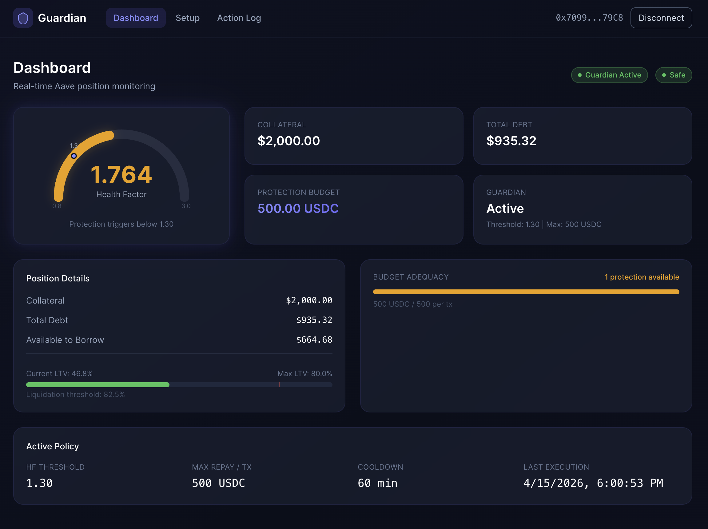

# AI DeFi Guardian

AI-powered liquidation protection for Aave V3. Users deposit a protection budget, set a health factor threshold, and an AI agent automatically repays debt when their position is at risk — preventing costly liquidations while they sleep.

**Key difference from rule-based tools like DeFi Saver:** Every decision includes AI reasoning permanently recorded on-chain via contract events — anyone can audit exactly why the AI acted.

> **See it in action:** [Full Demo Walkthrough](DEMO.md) — Health Factor **1.15 (Danger) → 1.76 (Safe)**, fully automated with screenshots.

---

## Table of Contents

- [Demo](#demo)
- [How It Works](#how-it-works)
- [Architecture](#architecture)
- [Smart Contracts](#smart-contracts)
- [AI Agent](#ai-agent)
- [Frontend](#frontend)
- [Security Design](#security-design)
- [Tech Stack](#tech-stack)
- [Sepolia Deployment](#sepolia-deployment)
- [Local Development](#local-development)
- [Project Structure](#project-structure)
- [License](#license)

---

## Demo



The AI Agent detected a dangerous Aave position (HF 1.15), called Claude for a risk assessment, and automatically repaid 500 USDC — pushing the health factor from **1.15 to 1.76** in a single transaction.

| Metric | Before | After |
|--------|--------|-------|
| Health Factor | 1.150 (Danger) | **1.764 (Safe)** |
| Total Debt | $1,434.78 | $935.32 |
| Protection Budget | 1000 USDC | 500 USDC |
| Current LTV | 71.7% | 46.8% |

**[See the full demo walkthrough with screenshots →](DEMO.md)**

---

## How It Works

```
  ┌─────────────┐          ┌─────────────────┐          ┌─────────────────┐
  │  1. Setup    │          │  2. Monitor      │          │  3. Protect      │
  │              │          │                  │          │                  │
  │  User sets:  │          │  AI Agent reads  │          │  Claude decides  │
  │  • HF thresh │─────────▶│  chain every     │─────────▶│  amount + reason │
  │  • Max repay │          │  5 minutes       │          │  → on-chain tx   │
  │  • Budget    │          │                  │          │  → reasoning log │
  └─────────────┘          └─────────────────┘          └─────────────────┘
```

1. **User registers** a protection policy (HF threshold, max repay per tx, cooldown) and deposits USDC into the Guardian Vault
2. **AI Agent monitors** all registered users' health factors every 5 minutes, reading Aave position data and ETH market prices via Chainlink
3. **When HF drops below threshold**, Claude API analyzes the situation (market trend, budget, urgency) and decides whether to repay, how much, and why
4. **On-chain execution**: Vault contract repays Aave debt on behalf of the user, with the AI's reasoning permanently stored in a contract event

---

## Architecture

### System Overview

```
┌──────────────────────────────────────────────────────────────────────┐
│                         Frontend (React + wagmi)                     │
│                                                                      │
│   Dashboard          Setup              Action Log                   │
│   • HF gauge         • setPolicy()      • ProtectionExecuted events  │
│   • Position data    • deposit()        • AI reasoning display       │
│   • LTV bar          • withdraw()       • TX details                 │
│   • Budget adequacy  • deactivate()                                  │
└──────────────────────────────┬───────────────────────────────────────┘
                               │ wagmi / viem (read + write)
┌──────────────────────────────┼───────────────────────────────────────┐
│                        Smart Contracts (Solidity)                     │
│                                                                      │
│   GuardianRegistry ◄───── GuardianVault (ERC-4626) ────► AaveInteg.  │
│   • policies              • protection budgets          • read HF    │
│   • registered users      • executeRepayment()          • read debt  │
│   • cooldown tracking     • fee collection              • repay()    │
└──────────────────────────────┬───────────────────────────────────────┘
                               │ ethers.js (read + execute)
┌──────────────────────────────┼───────────────────────────────────────┐
│                          AI Agent (TypeScript)                        │
│                                                                      │
│   Monitor Loop ──► Read Chain ──► Claude API ──► Execute Repayment   │
│   every 5 min      HF, debt,     decide action   safety checks       │
│                    budget, ETH    + amount         + on-chain tx      │
│                    price          + reasoning                         │
│                                                                      │
│   Fail-safe: any error → default "monitor" (no action taken)         │
└──────────────────────────────────────────────────────────────────────┘
```

### Contract Interaction

```
┌──────────┐         ┌───────────────────┐         ┌──────────────────┐
│   User   │         │  Protocol Owner   │         │    AI Agent      │
│  (EOA)   │         │     (EOA)         │         │     (EOA)        │
└────┬─────┘         └────────┬──────────┘         └────────┬─────────┘
     │                        │                             │
     │  setPolicy()           │  deploy & setVault()        │  executeRepayment()
     │  deposit()             │  pause() / unpause()        │
     │  withdraw()            │  setProtocolAgent()         │
     │  deactivate()          │                             │
     ▼                        ▼                             ▼
┌─────────────────────────────────────────────────────────────────────┐
│                         On-Chain Contracts                          │
│                                                                     │
│  ┌──────────────────┐    reads     ┌──────────────────────────┐    │
│  │ GuardianRegistry │◄────────────│     GuardianVault        │    │
│  │                  │             │     (ERC-4626)            │    │
│  │ • policies       │ recordExec  │                          │    │
│  │ • registeredUsers│◄────────────│ • protocolAgent          │    │
│  │ • vault          │             │ • protocolTreasury       │    │
│  │ • owner          │             │ • owner                  │    │
│  └──────────────────┘             └────────────┬─────────────┘    │
│                                                │                   │
│                                                │ transfer USDC     │
│                                                │ + repayOnBehalf() │
│                                                ▼                   │
│                                   ┌──────────────────────────┐    │
│                                   │   AaveIntegration        │    │
│                                   │ • aavePool (immutable)   │    │
│                                   │ • usdc (immutable)       │    │
│                                   │ • vault                  │    │
│                                   └────────────┬─────────────┘    │
│                                                │ approve + repay()│
└────────────────────────────────────────────────┼─────────────────┘
                                                 ▼
                                   ┌──────────────────────────┐
                                   │      Aave V3 Pool        │
                                   │   (External Protocol)    │
                                   └──────────────────────────┘
```

### Permission Matrix

| Function | Caller |
|----------|--------|
| Registry.setPolicy / deactivate | Any user (for themselves) |
| Registry.setVault | Owner (one-time only) |
| Registry.recordExecution | Vault only |
| AaveIntegration.setVault | Owner (one-time only) |
| AaveIntegration.repayOnBehalf | Vault only |
| AaveIntegration.getHealthFactor / getUserDebt | Anyone (view) |
| Vault.deposit / withdraw | Any user (for themselves) |
| Vault.executeRepayment | protocolAgent only |
| Vault.pause / unpause / setProtocolAgent | Owner only |

---

## Smart Contracts

| Contract | Role | Key Functions |
|----------|------|---------------|
| **GuardianRegistry** | User policy storage + registered user list for Agent to iterate | `setPolicy()`, `deactivate()`, `getPolicy()`, `getRegisteredUsers()` |
| **GuardianVault** (ERC-4626) | Holds USDC protection budgets, executes repayments with safety checks (cooldown, budget cap, debt cap), collects 0.1% protocol fee | `deposit()`, `withdraw()`, `executeRepayment()` |
| **AaveIntegration** | Wraps Aave V3 interactions behind a clean interface, isolating the external dependency | `getHealthFactor()`, `getUserDebt()`, `repayOnBehalf()` |

**Safety checks in `executeRepayment()`:** only callable by AI Agent, verifies policy is active, enforces per-tx limit, checks sufficient budget, caps to actual debt, two-tier cooldown (normal + emergency bypass when HF < threshold - 0.2). Every execution emits `ProtectionExecuted` with the AI's reasoning stored on-chain.

---

## AI Agent

### Design Decision

Traditional agent architecture (code-driven loop + Claude as advisor) rather than Agent SDK + Tool Use. The code drives a fixed pipeline (read chain → filter → ask Claude → execute), calling Claude only once per at-risk user per cycle. This keeps API costs low and behavior predictable.

### Monitor Loop

```
Every 5 minutes (10 seconds in MOCK_MODE):

1. Read registeredUsers from Registry (deduplicate)
2. For each user:
   a. Parallel read: HF, policy, budget, debt, ETH market data
   b. If HF > threshold × 1.2 → safe, skip (no Claude call, saves cost)
   c. Build AgentContext with all data
   d. Call Claude API → returns JSON decision
   e. If action == "repay" → executePayment with safety checks
3. Single user failure does not affect other users
```

### Decision Types

| Decision | When | Action |
|----------|------|--------|
| `repay` | HF below threshold + ETH declining | Execute repayment on-chain |
| `monitor` | Uncertain / ETH rebounding | Do nothing, wait for next cycle |
| `alert_only` | Budget too low to be effective | Log warning only |

### Fail-Safe Design

The agent never takes action when uncertain:
- Claude API down → default to `monitor`
- Invalid JSON response → default to `monitor`
- Any exception → no execution, only observe
- `executePayment` re-reads budget and debt before executing (may have changed during Claude call)
- Amount capped to min(AI request, maxRepayPerTx, budget, debt)

### Chainlink Price Cache

Chainlink only returns current price, no history API. The agent stores each price reading in memory (up to 288 points = 24h at 5min intervals) to calculate 1h/24h price changes. On fresh start, changes return 0%, causing Claude to lean toward conservative decisions.

---

## Frontend

Three-page React app with dark theme, glass morphism cards, and real-time data (10-second auto-refresh).

### Dashboard

| Component | What it shows |
|-----------|--------------|
| **HF Gauge** | SVG semicircle meter, color-coded (green > yellow > red > pulsing red). Purple dot marks the protection threshold. |
| **Stat Cards** | Collateral (USD), Total Debt (USD), Protection Budget (USDC), Guardian status |
| **Position Details** | Collateral / Debt / Available to Borrow, LTV progress bar with liquidation threshold marker |
| **Budget Adequacy** | How many full protections the budget can cover (budget / maxRepay) |
| **Active Policy** | HF threshold, max repay, cooldown, last execution time |

### Setup

| Section | Functions |
|---------|----------|
| **Protection Policy** | Set HF threshold (1.05-1.80), max repay (USDC), cooldown (min 60 min). Calls `Registry.setPolicy()`. Validation before submission. |
| **Protection Budget** | Shows vault balance + wallet USDC balance. Deposit (auto-approves if needed) or withdraw. Calls `Vault.deposit()` / `Vault.withdraw()`. |

### Action Log

Reads `ProtectionExecuted` events from the Vault contract via `viem.getLogs()`, polling every 15 seconds.

Each event row shows:
- Repay amount + user address
- HF change visualization (red → green)
- Timestamp
- Expandable: **AI reasoning** (Claude's explanation, stored on-chain), block number, TX hash

---

## Security Design

| Layer | Protection |
|-------|-----------|
| **Bounded permissions** | AI can only spend the user's pre-deposited budget. Aave collateral is never touched by Guardian contracts. |
| **Per-TX limits** | Max repay amount set by user, enforced on-chain in `executeRepayment()`. |
| **Two-tier cooldown** | Normal cooldown prevents budget drain from rapid executions. Emergency bypass (HF < threshold - 0.2) allows protection during rapid price crashes. |
| **Pausable** | Owner can emergency-pause all `executeRepayment()` calls. User deposits/withdrawals remain unaffected. |
| **Fail-safe agent** | Any Claude API error, timeout, or invalid response defaults to "monitor" — the agent never executes when uncertain. |
| **On-chain audit trail** | Every AI decision's reasoning is permanently stored in `ProtectionExecuted` events. No off-chain database needed. |
| **Re-read before execute** | Agent re-reads budget and debt right before transaction (values may change during Claude API call). |

---

## Tech Stack

| Layer | Technology |
|-------|-----------|
| Contracts | Solidity ^0.8.20, Foundry, OpenZeppelin Contracts v5 (ERC-4626, Ownable, Pausable) |
| Agent | TypeScript, Node.js 20+, ethers.js v6, Anthropic SDK, Claude claude-haiku-4-5 |
| Frontend | React 19, Vite, wagmi, viem, TailwindCSS v4, react-router-dom |
| Price Feed | Chainlink ETH/USD (`0x694AA1769357215DE4FAC081bf1f309aDC325306` on Sepolia) |
| Testing | Foundry — 60 unit tests + 8 Sepolia fork integration tests |
| Network | Ethereum Sepolia testnet (Anvil fork for local development) |

---

## Sepolia Deployment

All contracts deployed and verified on Etherscan:

| Contract | Address |
|----------|---------|
| GuardianRegistry | [`0x2a1eb5F43271d2d1aa0635bb56158D2280d6e7cC`](https://sepolia.etherscan.io/address/0x2a1eb5F43271d2d1aa0635bb56158D2280d6e7cC) |
| AaveIntegration | [`0x0cF45f3ECb4f67ea4688656c27a9c7bfe11E571E`](https://sepolia.etherscan.io/address/0x0cF45f3ECb4f67ea4688656c27a9c7bfe11E571E) |
| GuardianVault | [`0xBB13da705D2Aa3DAA6ED8FfFcC83AD534281F27A`](https://sepolia.etherscan.io/address/0xBB13da705D2Aa3DAA6ED8FfFcC83AD534281F27A) |

**Note:** Sepolia Aave V3 reserves are currently frozen. Use Anvil fork for full end-to-end testing (see below).

---

## Local Development

### Prerequisites

- Node.js 20+ (`nvm use 20`)
- Foundry toolchain (`forge`, `cast`, `anvil`)
- MetaMask browser extension

### 1. Clone & Install

```bash
git clone https://github.com/your-username/AIDefiGuardian.git
cd AIDefiGuardian

# Smart contracts
forge install

# AI Agent
cd agent && npm install && cd ..

# Frontend
cd frontend && npm install && cd ..
```

### 2. Environment Setup

```bash
# Root .env (for Foundry & Anvil)
cp .env.example .env
# Fill in: SEPOLIA_RPC_URL, PRIVATE_KEY

# Agent .env
cp agent/.env.example agent/.env
# Fill in: SEPOLIA_RPC_URL, PRIVATE_KEY, ANTHROPIC_API_KEY

# Frontend .env
cp frontend/.env.example frontend/.env
# Default: VITE_RPC_URL=http://127.0.0.1:8545
```

### 3. Run Tests

```bash
# Unit tests only (no RPC needed, fast)
forge test

# Fork integration tests (needs SEPOLIA_RPC_URL in .env)
forge test --match-contract GuardianForkTest -vvv

# Frontend type check + build
cd frontend && npx tsc --noEmit && npx vite build
```

### 4. Full End-to-End Demo (Anvil Fork)

Since Sepolia Aave V3 reserves are frozen, use an Anvil fork for complete testing:

**Terminal 1 — Start Anvil fork:**
```bash
source .env
anvil --fork-url $SEPOLIA_RPC_URL
```

**Terminal 2 — One-click setup:**
```bash
./script/setup-demo.sh
```

This script automatically unfreezes Aave USDC, injects liquidity, creates a test position with HF ~1.15 using Anvil account 1.

**Terminal 3 — Start frontend:**
```bash
cd frontend && npm run dev
```

**In the browser (http://localhost:5173):**
1. Configure MetaMask: Sepolia network RPC → `http://127.0.0.1:8545`
2. Import Anvil account 1 (private key in setup script output)
3. **Setup page** → set policy (threshold 1.3, max repay 500, cooldown 60 min) + deposit 1000 USDC
4. **Dashboard** → verify HF ~1.15, position data, budget adequacy

**Terminal 4 — Run AI Agent:**
```bash
cd agent && MAX_CYCLES=1 npx ts-node src/index.ts
```

The agent detects HF 1.15 < threshold 1.3, calls Claude, executes a 500 USDC repayment → HF recovers to ~1.76. Check **Action Log** page to see the event with AI reasoning.

**[Full walkthrough with screenshots →](DEMO.md)**

---

## Project Structure

```
src/                            — Solidity smart contracts
  ├── GuardianRegistry.sol      — User policy registry
  ├── GuardianVault.sol         — ERC-4626 vault + repayment execution
  ├── AaveIntegration.sol       — Aave V3 interaction wrapper
  └── interfaces/
      └── IAavePool.sol         — Minimal Aave V3 Pool interface
test/                           — Foundry tests
  ├── GuardianRegistry.t.sol    — 23 tests
  ├── AaveIntegration.t.sol     — 13 tests
  ├── GuardianVault.t.sol       — 24 tests
  ├── integration/
  │   └── Guardian.fork.t.sol   — 8 fork tests (real Sepolia Aave V3)
  └── mocks/
      ├── MockAavePool.sol      — Controllable HF/debt mock
      └── MockERC20.sol         — Mintable ERC20 mock
script/
  ├── Deploy.s.sol              — 5-step deployment (breaks circular deps)
  ├── interact.sh               — CLI helpers for cast commands
  └── setup-demo.sh             — One-click Anvil fork demo setup
agent/                          — AI Agent (TypeScript)
  ├── src/
  │   ├── ai.ts                 — Claude API call + JSON parsing + fail-safe
  │   ├── onchain.ts            — Read chain data + execute repayment tx
  │   ├── market.ts             — Chainlink ETH/USD + in-memory price cache
  │   ├── executePayment.ts     — Safety checks before on-chain execution
  │   ├── index.ts              — Main monitor loop
  │   ├── mock.ts               — MOCK_MODE simulated data
  │   ├── logger.ts             — Structured JSON logging with source tracking
  │   └── types.ts              — Policy, AgentContext, AIDecision, MarketData
  └── .env.example
frontend/                       — React frontend
  ├── src/
  │   ├── config/               — wagmi config + contract addresses & ABIs
  │   ├── hooks/                — useGuardian (9 hooks), useAavePosition, useActionLog
  │   ├── components/           — Layout, HfGauge (SVG), StatusBadge
  │   └── pages/                — Dashboard, Setup, ActionLog
  └── .env.example
docs/
  └── images/                   — Demo screenshots (referenced by DEMO.md)
DEMO.md                         — End-to-end demo walkthrough with screenshots
```

---

## License

MIT
